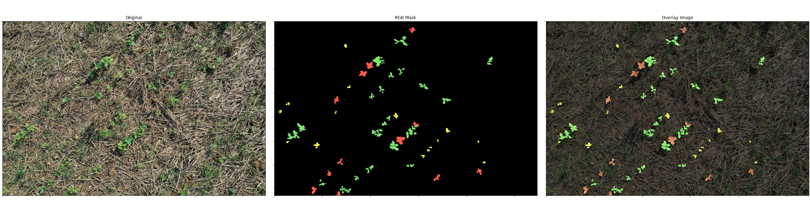
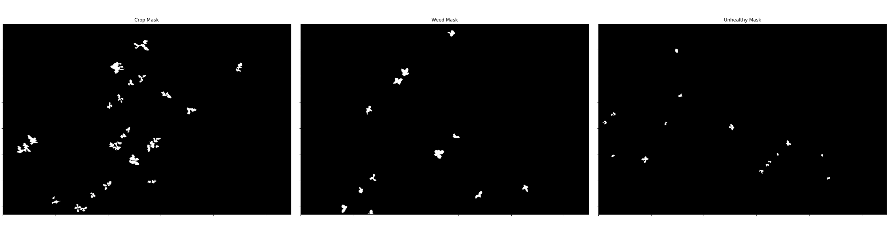

# Steps for Data Preprocessing

1. Annotating using CVAT
2. Other steps are yet to discuss 

## Preprocessing on CVAT output

After annotating with CVAT, we can export the dataset into segmentation mask, COCO Json and other formats. However, in this challenge, we will only be using segmentation mask. 

Code - [mask-extraction.ipynb](mask-extraction.ipynb)

### [Visualizing on RGB Segmenttion Mask from CVAT](assets/sample-cvat-output)

### [Visualizing on Binary Mask of Each Class](assets/sample-cvat-output)

