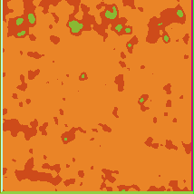

# Unsupervised Segmentation with Differential Feature Clustering

## Data Preparation

Target dataset : Rye (For experimenting purpose) \
Image Size : 224 x 224

Dataset folder structure should be as follow:
```
Rye
  |_ image00.jpe
  |_ image01.jpe
  |_ image03.jpe
```

## Model Training 

To train the model, run:
```
python train.py --nChannel 100 \
       --maxIter 100 --minLabels 8 \
       --visualize 0 --weights_path "{weight_file_path}.pt" \
       --nConv 3 \
       --input '{dataset_path}'
```
Note: If you want to use on Google Colab, notebooks are available in `notebooks/` folder for your reference.

## Model Inference

To inference the model, run:
```
python inference.py \
        --weights "{weight_file_path}.pt" \
        --nChannel 100 \
        --nConv 3 \
        --output "{output_filename}.png" \
        --input "{inference_image}.png"
```

## Inference Result

This the model inference result using the weight `weights/batch_weights_c_100_conv_3_RGB.pt`. Currently, this is the best model that we trained so far. \
You can see that the model can differentiate crops and weeds in the following image.

Input                      |  Inference Result
:-------------------------:|:-------------------------:
  |   